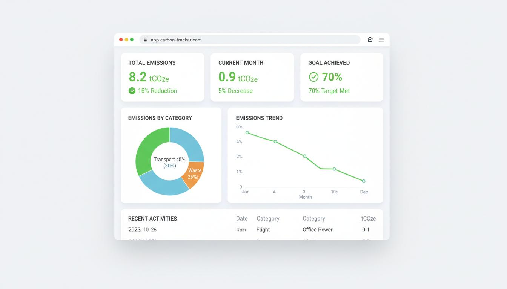

# CarbonWise

An AI-powered Carbon Footprint Awareness Platform that helps individuals understand, track, and reduce their carbon footprint through precise calculations, beautiful visualizations, and personalized recommendations.



## Features

- **Carbon Footprint Calculator** — Multi-step form covering transport, home energy, food, and lifestyle habits
- **AI-Powered Insights** — Personalized recommendations powered by OpenAI (with robust fallback)
- **Beautiful Dashboard** — Stat cards, donut charts, trend lines, goals, and badges
- **Progress Tracking** — Historical footprint reports with visual trend analysis
- **Weekly Challenges** — Accept and complete reduction goals with estimated CO2 savings
- **What-If Simulator** — Explore how habit changes affect your footprint before making them
- **Community Leaderboard** — Fair ranking based on improvement percentage, not lowest emissions
- **Badge System** — Earn badges for milestones like first report, goal completion, and reduction achievements
- **Methodology Page** — Transparent explanation of all calculations and emission factors

## Tech Stack

| Layer | Technology |
|-------|-----------|
| Frontend | React 19 + TypeScript + Vite + Tailwind CSS + shadcn/ui |
| Charts | Recharts |
| Animations | Framer Motion |
| Auth | Supabase Auth (email/password) |
| Database | Supabase PostgreSQL |
| AI | OpenAI API (GPT-4o-mini) with JSON mode |
| Icons | Lucide React |

## Carbon Calculation Methodology

All carbon calculations are **deterministic and formula-based**. AI is used **only** for generating insights and recommendations, never for raw calculations.

### Emission Factors Used

| Activity | Factor | Source |
|----------|--------|--------|
| Car (petrol) | 0.192 kg CO2e/km | EPA |
| Bus | 0.089 kg CO2e/km | DEFRA |
| Train/Metro | 0.041 kg CO2e/km | DEFRA |
| Short Flight | 90 kg CO2e/hour | ICAO |
| Electricity | 0.7 kg CO2e/kWh | EIA |
| Vegan Diet | 100 kg CO2e/month | Oxford |
| Vegetarian Diet | 150 kg CO2e/month | Oxford |
| Mixed Diet | 220 kg CO2e/month | Oxford |
| Meat-Heavy Diet | 320 kg CO2e/month | Oxford |

### Impact Levels

- **Low Impact**: < 500 kg CO2e/month
- **Moderate Impact**: 500-1000 kg CO2e/month
- **High Impact**: > 1000 kg CO2e/month

## Setup Instructions

### 1. Prerequisites

- Node.js 20+
- A Supabase account (free tier works)
- (Optional) An OpenAI API key for AI insights

### 2. Clone and Install

```bash
git clone <repo-url>
ccd carbonwise
npm install
```

### 3. Supabase Setup

1. Create a new project at [supabase.com](https://supabase.com)
2. Go to the SQL Editor and run the schema setup (see `supabase/schema.sql`)
3. Copy your project URL and anon key from Project Settings > API

### 4. Environment Variables

```bash
cp .env.example .env
```

Edit `.env` with your credentials:

```env
VITE_SUPABASE_URL=https://your-project.supabase.co
VITE_SUPABASE_ANON_KEY=your-anon-key
VITE_OPENAI_API_KEY=your-openai-key  # Optional
```

### 5. Database Schema

Run this SQL in your Supabase SQL Editor:

```sql
-- Enable RLS
alter table profiles enable row level security;
alter table footprint_reports enable row level security;
alter table user_activities enable row level security;
alter table goals enable row level security;
alter table user_badges enable row level security;
alter table ai_insights enable row level security;

-- Create tables (see full schema in docs/)
-- Tables: profiles, footprint_reports, user_activities, goals, badges, user_badges, ai_insights
```

See `supabase/schema.sql` for the complete schema with all tables, RLS policies, and seed data.

### 6. Run Development Server

```bash
npm run dev
```

The app will be available at `http://localhost:3000`.

### 7. Build for Production

```bash
npm run build
```

Output will be in `dist/public/`.

## Project Structure

```
carbonwise/
├── api/                  # tRPC + Hono backend
├── src/
│   ├── components/       # Reusable UI components
│   │   ├── AppNavbar.tsx
│   │   ├── StatCard.tsx
│   │   ├── CategoryBreakdownChart.tsx
│   │   ├── FootprintTrendChart.tsx
│   │   ├── RecommendationCard.tsx
│   │   ├── GoalCard.tsx
│   │   ├── BadgeCard.tsx
│   │   ├── EmptyState.tsx
│   │   └── ProtectedRoute.tsx
│   ├── pages/            # Route-level pages
│   │   ├── Home.tsx           # Landing page
│   │   ├── AuthPage.tsx       # Login/signup
│   │   ├── CalculatorPage.tsx # Multi-step calculator
│   │   ├── DashboardPage.tsx  # Main dashboard
│   │   ├── ActionsPage.tsx    # Goals & recommendations
│   │   ├── SimulatorPage.tsx  # What-if simulator
│   │   ├── LeaderboardPage.tsx
│   │   └── MethodologyPage.tsx
│   ├── hooks/
│   │   └── useAuth.ts    # Supabase auth context
│   ├── lib/
│   │   ├── supabase.ts   # Supabase client
│   │   ├── calculator.ts # Deterministic calculation engine
│   │   └── aiInsights.ts # AI insight generation
│   ├── types/
│   │   └── supabase.ts   # Database types
│   ├── App.tsx
│   └── main.tsx
├── public/               # Static assets (images)
├── .env.example
├── package.json
├── tailwind.config.js
├── tsconfig.json
└── vite.config.ts
```

## AI Insights

The app generates personalized recommendations using OpenAI's GPT-4o-mini model. The AI receives:

- Total carbon footprint and category breakdown
- Highest emission category
- User profile (name, city, household size)

It returns structured JSON with:
- A friendly summary of the footprint
- Impact level classification
- 4 specific, actionable recommendations with difficulty and estimated savings

**If no OpenAI API key is configured**, the app falls back to pre-built rule-based recommendations organized by category.

## Authentication

CarbonWise uses Supabase Auth with email/password and optional Google OAuth:

- **Sign Up**: Creates a user account + profile record
- **Sign In**: JWT-based session management
- **Google Sign In**: Uses `supabase.auth.signInWithOAuth({ provider: 'google' })`
- **Protected Routes**: Dashboard, Actions, and Simulator require authentication
- **RLS**: Row Level Security ensures users can only access their own data

If Google sign-in is unavailable on localhost, check:

1. Google provider is enabled in Supabase Dashboard > Authentication > Sign In / Providers.
2. `http://localhost:3000/auth` is listed in Supabase Dashboard > Authentication > URL Configuration > Redirect URLs.
3. Your local `app/.env` has `VITE_SUPABASE_URL` and either `VITE_SUPABASE_ANON_KEY` or `VITE_SUPABASE_PUBLISHABLE_KEY` set.

## Badges

Users earn badges for milestones:

| Badge | Condition |
|-------|-----------|
| First Report | Complete first footprint calculation |
| Carbon Starter | Accept first reduction goal |
| Action Taker | Complete first goal |
| 10% Reducer | Reduce footprint by 10% from previous |
| Transport Saver | Complete a transport goal |
| Food Hero | Complete a food goal |
| Energy Saver | Complete an energy goal |
| Eco Shopper | Complete a lifestyle goal |
| Simulator Pro | Use the simulator 3 times |
| Goal Crusher | Complete 5 goals |

## License

MIT License — Open source carbon awareness.
